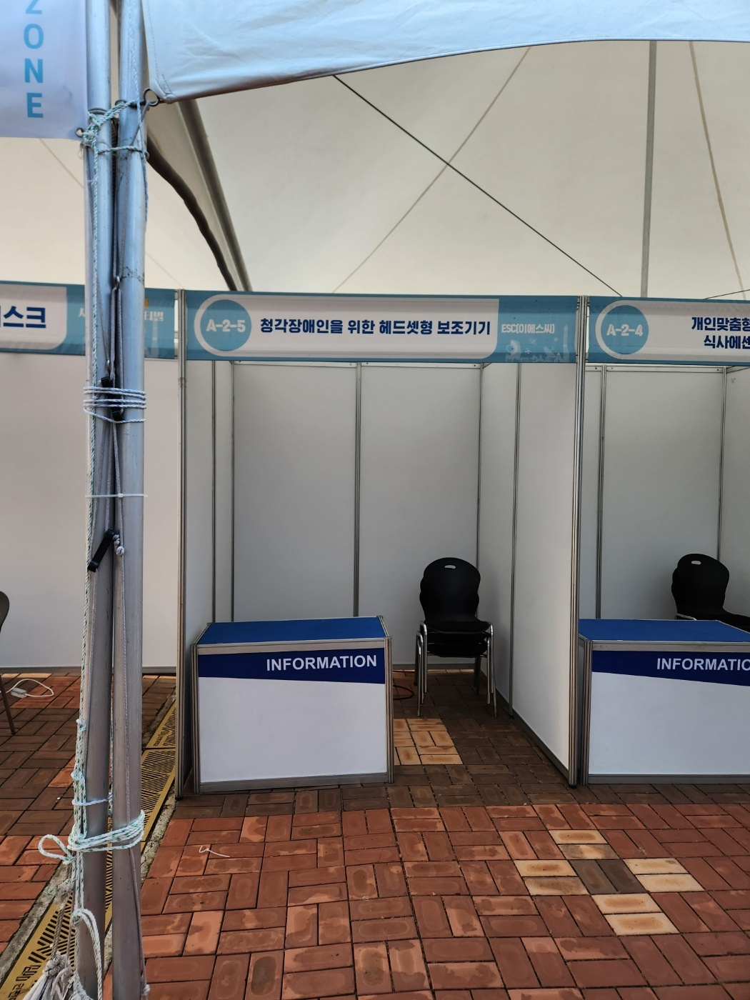
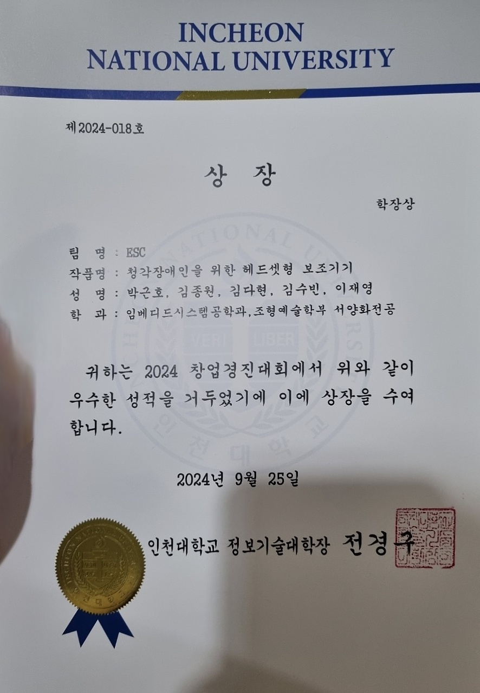
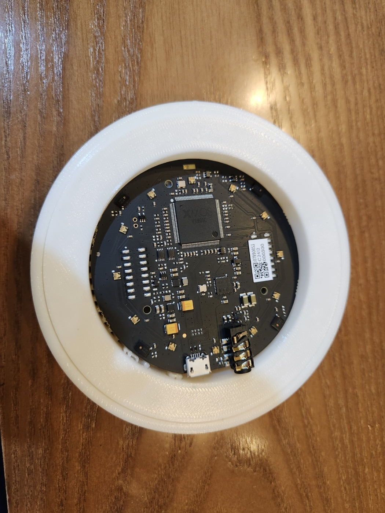
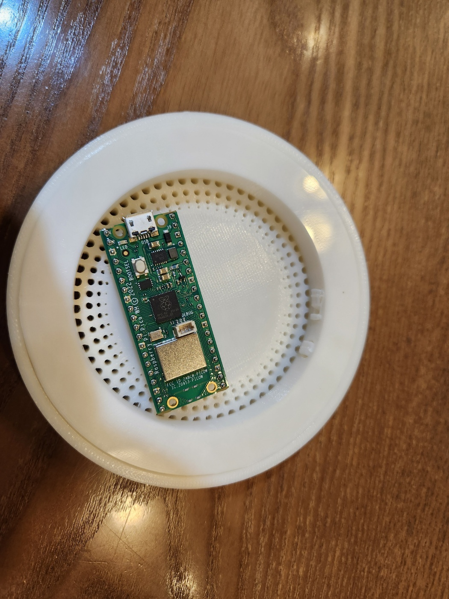
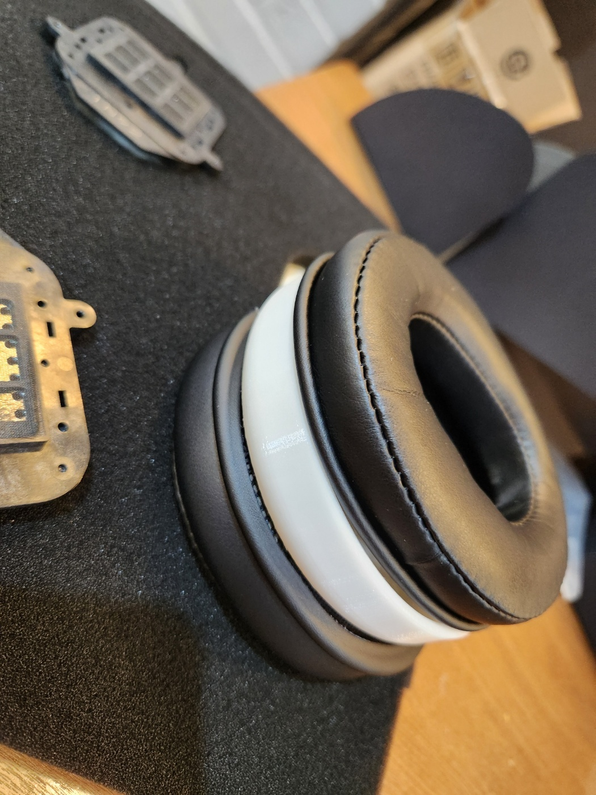
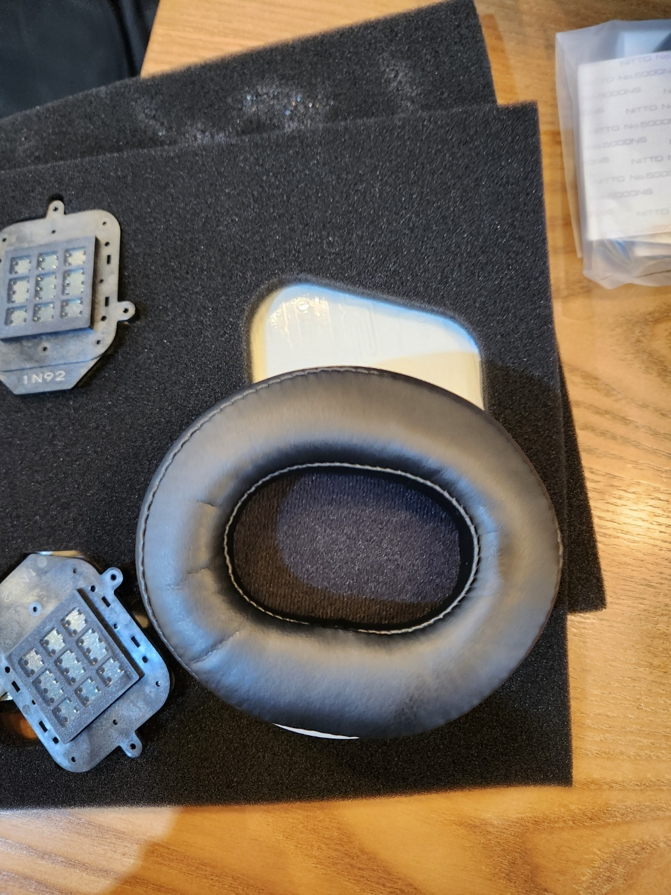
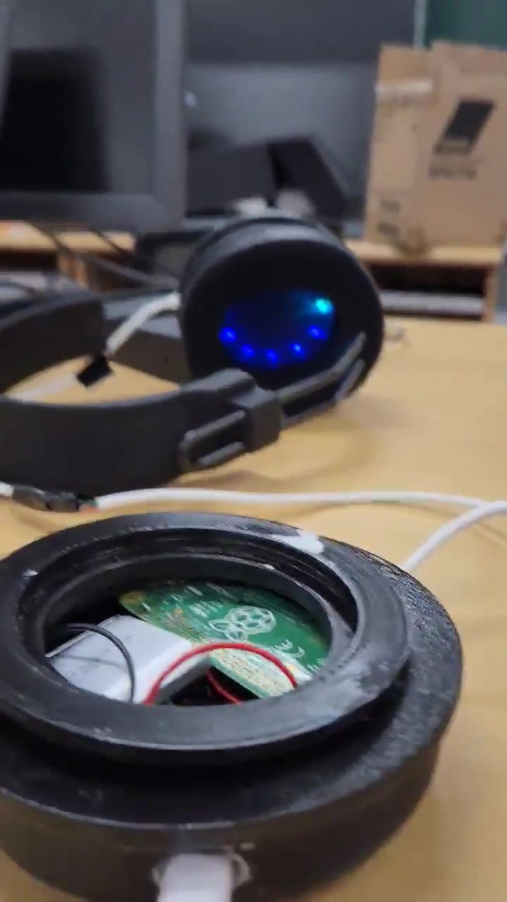
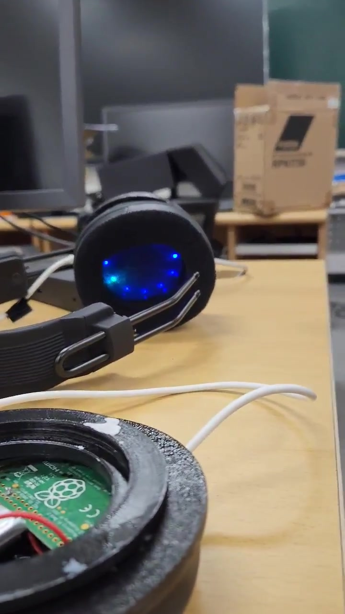

# 청각장애인을 위한 헤드셋형 보조기기

> 생활 소리를 인식하고 중요한 정보를 사용자에게 전달하는 헤드셋형 청각 보조 시스템
>
> 이 저장소는 팀 프로젝트를 포트폴리오용으로 재구성한 아카이브 저장소이며, 원본 통합 코드 저장소가 아닙니다.

청각장애인이 생활 속 중요한 소리를 놓치지 않도록, 음성을 STT로 텍스트 변환한 뒤 키워드 중요도를 판별하고 앱과 진동 알림으로 전달하는 보조기기 구조를 제안한 프로젝트입니다. 2024 창업경진대회에 출품되었고, 수상 및 전시 참여까지 이어졌습니다.

<table>
  <tr>
    <td align="center" valign="middle">
      
    </td>
    <td align="center" valign="middle">
      
    </td>
  </tr>
  <tr>
    <td align="center"><em>행사 부스 전경</em></td>
    <td align="center"><em>수상 증빙</em></td>
  </tr>
</table>

## 프로젝트 개요

| 항목 | 내용 |
|------|------|
| 팀명 | ESC |
| 프로젝트 성격 | 창업경진대회 출품 팀 프로젝트 |
| 주요 형태 | 헤드셋형 착용 보조기기 프로토타입 |
| 핵심 기능 방향 | 생활 소리 인식 → STT 변환 → 키워드 판별 → 앱 전달 → 사용자 알림 |
| 주요 구성 요소 | ReSpeaker 마이크 어레이, Raspberry Pi Pico WH, 진동 센서, 앱 연동 |
| 주요 대상 | 청각장애인 (병원·재활 센터 등 기관 활용도 고려) |
| 수상 | 2024 창업경진대회 수상 |

## 시스템 구조

판넬 기준으로 확인되는 전체 작동 흐름은 다음과 같습니다.

```
[음성인식 모듈 / 마이크 입력]
      ↓  생활 소리 인식
[처리부]
      ↓  STT 변환 → DB 조회 → 키워드 인식 → 중요도 판별
[앱 전송 / 진동 알림]
      ↓
[사용자 인지]
```

- **입력**: 음성인식 모듈이 생활 소리를 감지
- **처리**: STT 변환 후 DB 조회 및 키워드 중요도 판별
- **출력**: 앱으로 결과 전달 + 진동 센서로 사용자 직접 알림

구현 과정에서는 ReSpeaker 마이크 어레이와 Raspberry Pi Pico 계열 보드를 중심으로 구성 검토 및 연결 작업이 진행되었습니다.

이 구조는 단순 소리 수집 장치가 아니라, **소리의 의미를 해석하고 중요한 정보만 선별해 전달하는 보조 시스템**을 지향했습니다.

자세한 설계는 [시스템 설계 문서](docs/03_system_design.md)를 참고하세요.

## 하드웨어 구성

<table>
  <tr>
    <td align="center">
      
      <br><em>ReSpeaker 마이크 어레이</em>
    </td>
    <td align="center">
      
      <br><em>Raspberry Pi Pico 모듈</em>
    </td>
    <td align="center">
      
      <br><em>3D 프린팅 구조 부품</em>
    </td>
    <td align="center">
      
      <br><em>헤드셋 쿠션</em>
    </td>
  </tr>
</table>

## 내 기여

나는 이 프로젝트에서 **소프트웨어 구현 전반을 중심으로 참여한 팀원**이었습니다.

- **모듈 구성 검토**: ReSpeaker 마이크 어레이와 Raspberry Pi Pico 계열 보드 조합 검토 및 선택 참여
- **STT 음성 처리 로직 구현**: 마이크 입력 음성 처리 흐름 구성, STT 처리 로직 구현 및 연결, 후속 처리 흐름 정리
- **장치 간 통신 흐름 구성**: 마이크 입력 장치, 제어 보드, 앱 사이의 통신 경로 설계 및 연결
- **Android 앱 작업 보조**: 장치-앱 연동 관점에서 보조적으로 앱 작업 지원

하드웨어 직접 제작보다는 **어떤 모듈을 사용할지 선택하고, 장치 간 통신과 소프트웨어 흐름을 연결하는 역할**에 가까웠습니다.

팀 전체의 작업 분담과 맥락은 [나의 역할](docs/04_my_role.md) 문서에 정리되어 있습니다.

## 결과 및 수상

- **2024 창업경진대회** 출품 및 수상
- 행사 현장 전시 및 부스 운영 참여
- 내부 하드웨어 구성 사진과 실물 시연 영상 보존

이 프로젝트는 완성형 제품 개발 프로젝트가 아니라, **수상 및 전시까지 진행된 프로토타입 프로젝트**입니다. 정량적 성능 검증이나 상용화 수준의 완성도를 주장하지 않습니다.

자세한 내용은 [결과 및 수상](docs/05_results_and_awards.md) 문서를 참고하세요.

## 주요 증빙 자료

| 자료 | 설명 |
|------|------|
| [창업경진대회 판넬 PDF](assets/poster/2024_startup_competition_panel.pdf) | 대회 제출용 공식 판넬. 문제 정의, 시스템 구조, 목표 시장 포함 |
| [수상 상장](assets/images/award/award_certificate_main.jpg) | 수상 사실 증빙 이미지 |
| [행사 부스 사진](assets/images/booth/booth_overview.jpg) | 전시/행사 현장 참여 증빙 |
| [증빙 인덱스](docs/06_evidence_index.md) | 전체 증빙 자료 목록 및 활용 가능 주장 범위 정리 |

### 시연 영상

아래 이미지를 클릭하면 실물 시연 영상(~14초)으로 이동합니다. 헤드셋 외형 전반과 충전 장면이 포함되어 있습니다.

<table>
  <tr>
    <td align="center">
      <a href="assets/media/prototype/headset_demo.mp4">
        
      </a>
      <br><em>▶ 실물 시연 영상 (2초 지점)</em>
    </td>
    <td align="center">
      <a href="assets/media/prototype/headset_demo.mp4">
        
      </a>
      <br><em>▶ 실물 시연 영상 (9초 지점)</em>
    </td>
  </tr>
</table>

## 저장소 구조

```
├── docs/                      # 프로젝트 문서
│   ├── 01_project_overview.md
│   ├── 02_problem_and_solution.md
│   ├── 03_system_design.md
│   ├── 04_my_role.md
│   ├── 05_results_and_awards.md
│   ├── 06_evidence_index.md
│   └── 07_retrospective.md
├── assets/
│   ├── images/
│   │   ├── award/             # 수상 상장 이미지
│   │   ├── booth/             # 행사 부스 사진
│   │   ├── internal/          # 내부 부품 및 구성 사진
│   │   └── prototype/         # 시연 영상 대표 프레임 이미지
│   ├── media/prototype/       # 실물 시연 영상
│   └── poster/                # 창업경진대회 판넬 PDF
├── references/                # Organization 저장소 링크 및 외부 참고 메모
└── private_raw/               # 로컬 전용 원본 자료 (git 미포함)
```

## 관련 문서

| 문서 | 내용 |
|------|------|
| [프로젝트 개요](docs/01_project_overview.md) | 전체 개요, 배경, 목표, 구성 요소 |
| [문제 정의 및 해결 방향](docs/02_problem_and_solution.md) | 문제 배경과 해결 접근 방식 |
| [시스템 설계](docs/03_system_design.md) | 설계 방향, 구성 요소, 작동 흐름, 기록 한계 |
| [나의 역할](docs/04_my_role.md) | 개인 기여 영역과 팀 내 역할 구분 |
| [결과 및 수상](docs/05_results_and_awards.md) | 결과 요약, 수상 내용, 포트폴리오 설명 범위 |
| [증빙 자료 인덱스](docs/06_evidence_index.md) | 공개 자료 목록과 활용 가능 주장 범위 |
| [프로젝트 회고](docs/07_retrospective.md) | 잘한 점, 어려웠던 점, 배운 점 정리 |

## 코드베이스 보존 상태 안내

**이 저장소에는 최종 통합 코드베이스가 보존되어 있지 않습니다.**

현재 남아 있는 자료는 다음과 같습니다.

- 창업경진대회 공식 판넬 PDF
- 수상 상장 이미지
- 행사/부스 사진
- 내부 하드웨어 및 부품 사진
- 실물 시연 영상
- 일부 organization 저장소의 부분 개발 흔적 ([참고 링크](references/org_repo_links.md))

따라서 이 저장소는 프로젝트를 사실에 기반해 설명하기 위해 재구성한 **포트폴리오 아카이브**이며, 전체 기능 구현 코드를 포함하는 저장소가 아닙니다.
